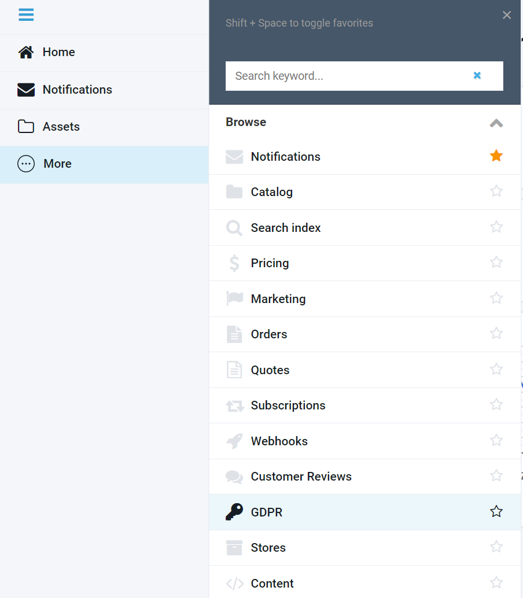
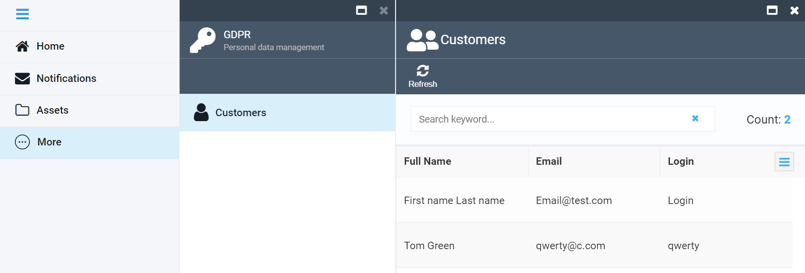
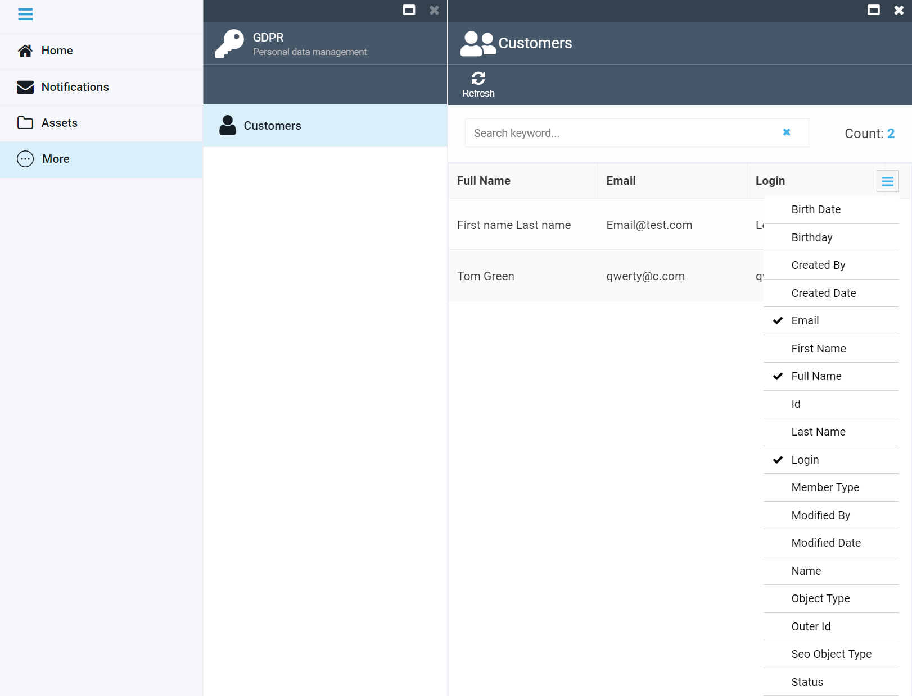
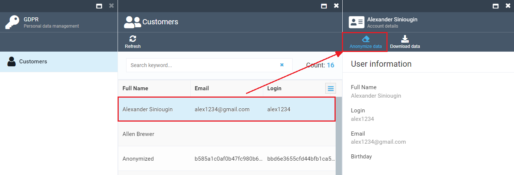
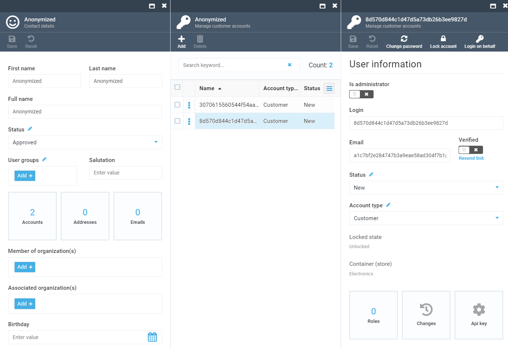
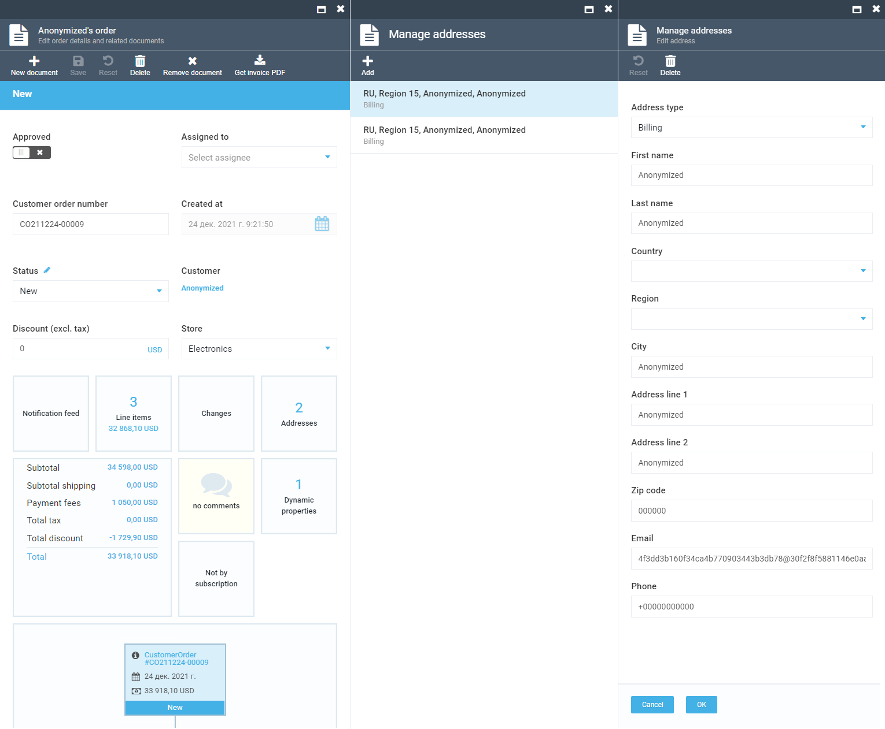
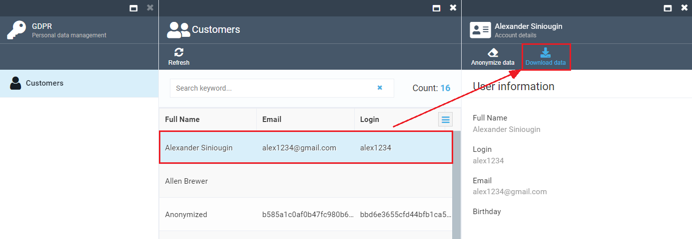

# GDPR Module Overview

## Purpose

The GDPR module supplied by Virto is a tool allowing you to supply the customer with or remove their personal details, by anonymizing them, from your online store. It is perfectly in line with the General Data Protection Regulation (GDPR) that enables every individual to request their personal data stored on a website or demand to remove such at any time.

## What Is GDPR?

The General Data Protection Regulation, or GDPR, is a regulation in the EU law that, basically, provides a right to a private individual residing in the EU to request their personal details stored with a third party at any time and, if applicable, to have them deleted from any third party website. To learn more about GDPR, please go [here](https://gdpr-info.eu/).

## What Does It Mean for You?

As an ecommerce store owner, you have to store your customers' details, such as their full name, email, birth date, shipping address, and other information. As per GDPR, however, any of your EU based customers may at any time request these details to learn which information of theirs you are storing or, if they opt to stop using your website, request to delete any personal information you have stored so far.

## How Does the GDPR Module Help?

With the GDPR module, you can provide your customer with their details stored on your website right upon their request by downloading those details within a single click of a button; or, you can also remove your customer's details, if they request so, by totally anonymizing them.

### Opening GDPR

To open the GDPR module, go to _More_ and click _GDPR_: 


<p align=center>Figure 1: Opening the GDPR Module</p>

### Using GDPR

Once open, the GDPR module will show you the home screen:


<p align=center>Figure 2: GDPR Module Home Screen</p>

This page will have the details of all your customers. By default, you will see the customer's full name, email, and login details. You can, however, customize the options to see any other of the available details by clicking the appropriate icon:


<p align=center>Figure 3: Customizing the Customer Details View</p>

Once you open this page, you can select any customer in the list to view their details and, if requested or deemed appropriate, either anonymize their personal information or download it to further send it to the customer.

To anonymize the details, hit the *Anonymize data* button:


<p align=center>Figure 4: Anonymizing Customer Details</p>

Once anonymized, the customer details will look like this:


<p align=center>Figure 5: Anonymized Contact Info</p>

As you can see on these screen captures, all customer personal details get anonymized, which is strictly in line with the GDPR.

***Note:*** *While customer login and email start appearing as a GUID once anonymized, their address and other personal data will just appear as Anonymized. This is because both login and email must still have valid values to store order data, even after anonymization.*


<p align=center>Figure 6: Anonymized Order Details</p>

To download the details, use the *Download data* button:


<p align=center>Figure 7: Downloading Customer Details</p>

Once downloaded, you will get a JSON file housing all personal details of the appropriate customer:

<details><summary>Downloaded Customer Details in JSON Format</summary>

```
{
	"firstName": "Alex",
	"lastName": "Starberg",
	"fullName": "Alex Starberg",
	"birthday": "1982-02-09T21:00:00Z",
	"emailAddresses": [],
	"phones": [],
	"addresses": [],
	"accounts": [
		{
			"login": "Login",
			"emailAddress": "123@test.com"
		},
		{
			"login": "bomba89@example.com",
			"emailAddress": "bomba89@example.com"
		}
	],
	"orders": [
		{
			"addresses": [
				{
					"firstName": "Alex",
					"lastName": "Starberg",
					"country": "United States",
					"region": "Tennessee",
					"city": "Chattanooga",
					"line1": "475 Uptain Rd.",
					"email": "bomba89@example.com",
					"phone": "(423) 978-0927"
				}
			]
		},
		{
			"addresses": [
				{
					"firstName": "Alex",
					"lastName": "Starberg",
					"country": "United States",
					"region": "Tennessee",
					"city": "Chattanooga",
					"line1": "475 Uptain Rd.",
					"email": "bomba89@example.com",
					"phone": "(423) 978-0927"
				}
			]
		}
	]
}
```
</details>

For better readability, you can then convert the JSON output into text or CSV before sending the details to your customer.
