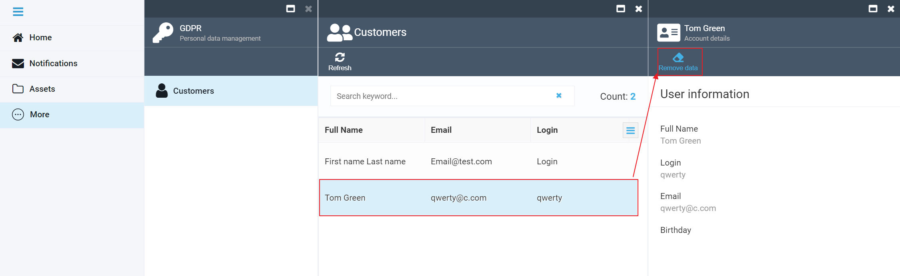

# GDPR Module Overview

## Purpose

The GDPR module supplied by Virto is a tool allowing you to supply the customer with or delete their personal details from your online store. It is perfectly in line with the General Data Protection Regulation (GDPR) that enables every individual to request their personal data stored on a website or demand to remove such at any time.

## What Is GDPR?

The General Data Protection Regulation, or GDPR, is a regulation in the EU law that, basically, provides a right to a private individual residing in the EU to request their personal details stored with a third party at any time and, if applicable, to have them deleted from any third party website. To learn more on GDPR, please go [here](https://gdpr-info.eu/).

## What Does It Mean for You?

As an ecommerce store owner, you have to store your customers' details, such as their full name, email, birth date, shipping address, and other information. As per GDPR, however, any of your EU based customers may at any time request these details to learn which information of theirs you are storing or, if they opt to stop using your website, request to delete any personal information you have stored so far.

## How Does the GDPR Module Help?

With the GDPR module, you can delete your customer details right upon their request, within a single click of a button.

### Opening GDPR

To open the GDPR module, go to _More_ and click _GDPR_: 

Figure 1: Opening the GDPR Module

### Using GDPR

Once open, the GDPR module will show you the home screen:

Figure 2: GDPR Module Home Screen

This page will have the details of all your customers. By default, you will see the customer's full name, email, and login details. You can, however, customize the options to see any other of the available details by clicking the appropriate icon:

Figure 3: Customizing the Customer Details View

Once you open this page, you can select any customer in the list to view their details and, if requested or deemed appropriate, delete their personal information. To delete the details, hit the *Remove Data* button:

Figure 4: Removing Customer Details

